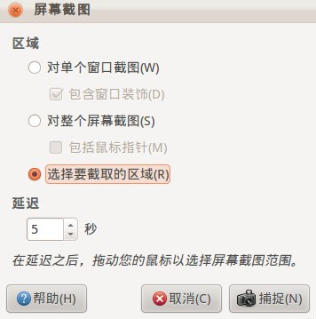

.. screenshot tools

截图工具
##################################################

scrot
==================================================
Scrot是一个命令行下使用的截图工具，支持全屏、窗口、选取、多设备、缩略图、延时，甚至可以截图完毕之后指定某程序打开截好的图片。

Examples
--------------------------------------------------
- 对全屏截图并保存文件名 ::

      scrot ~/abc.png

- 抓取窗口，b 参数表示带边框窗体，s 用户可以指定窗口 ::

      scrot -bs ~/abc.png

- 抓取鼠标选定区域 ::

      scrot -s ~/abc.png

- 延时抓取，d 表示延时，c 倒计时，10 是秒，抓菜单等其他东西时很好用 ::

      scrot -cd 10 ~/abc.png

- 生成缩略图，t 表示要生成缩略图， 20% 表示缩略图的比例， s 表示截取用户划定区域 ::

      scrot -t 20% -s ~/abc.png

- 启用某项操作 s 划定截图，-e 采用某项行为，这里用 gimp 打开截图图片 ::

      scrot -s ~/abc.png -e 'gimp $f'

gimp
==================================================
gimp不仅可以截图还可以对图片进行处理，可以说是非常强大。打开gimp，点击菜单项
文件->创建->屏幕截图，弹出截图的对话框。如下图

KSnapshot
==================================================
KSnapshot是目前在ubuntu下用过的最好用的截图工具，不过要依赖kde的一堆东西，安装它要额外安装好多东西，偶用的gnome的界面，实在是用不起。
