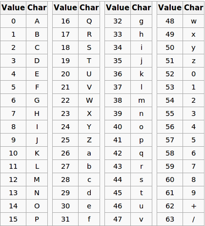
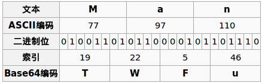

.. base64

base64
##################################################

原理简介
==================================================
Base64是一种基于64个可打印字符来表示二进制数据的表示方法。

Base64的代码表，如下图：

这64个字符再加上‘=’做补位，一共65个字符

Base64的编码原理演示,如下图：

Examples
==================================================
::

  >>> import base64
  >>> base64.b64encode("ellios鸭梨", "-_")
  'ZWxsaW9z6bit5qKo'
  >>> base64.b64decode("ZWxsaW9z6bit5qKo", "-_")
  'ellios\xe9\xb8\xad\xe6\xa2\xa8'
  >>> print base64.b64decode("ZWxsaW9z6bit5qKo", "-_")
  ellios鸭梨
  
.. attention::

   由于'+/'这两个特殊字符有些时候会有特殊含义，如url中， 所以可以用其他字符来代替，这里用的是'-_'。

Reference
==================================================
`维基中的base64介绍 <http://zh.wikipedia.org/wiki/Unicode>`_
